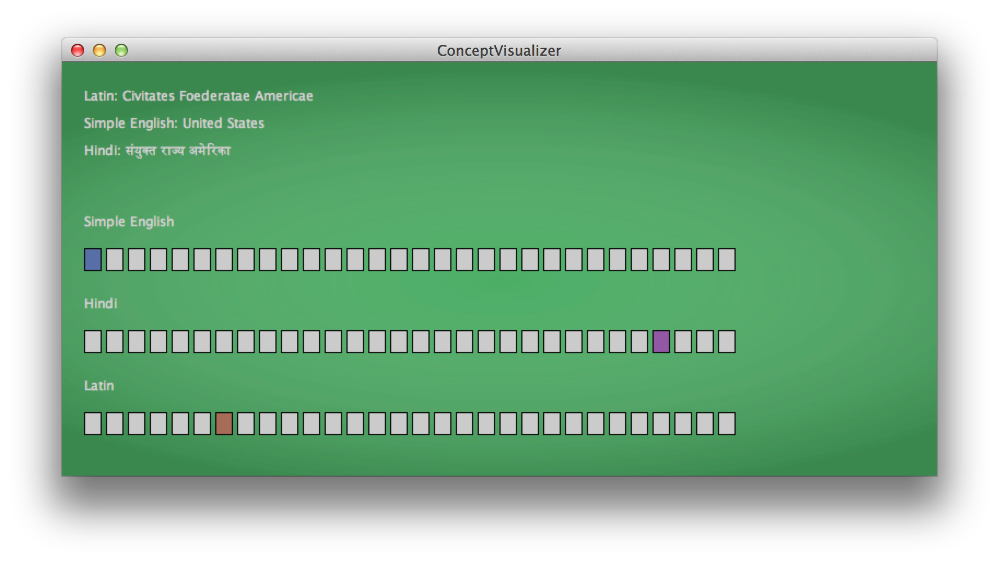

Concept Visualizer
===

Wikipedia offers encyclopedias in [287 different languages](http://meta.wikimedia.org/wiki/List_of_Wikipedias), from English to Arabic to Inuktitut.

This program identifies the most popular articles in each language, and uncover the articles in other
  languages that reference the same concept.

In this visualization, each row of boxes represents the most popular Wikipedia articles in a particular language (Simple English, Hindi, Latin).
The user of this visualization is hovering their cursor over the Hindi article for "United States", and it is highlighted in purple.
The visualization has highlighted the corresponding articles in Simple English (blue), and Latin (orange).

This program rely on the [wikAPIdia software library](https://github.com/shilad/wikAPIdia)
developed by Shilad, Rebecca Gold, [Brent Hecht](http://www.brenthecht.com/), and many others.
wikAPIdia is a large, complex project, so this program has a helper class called WikapidiaWrapper.
